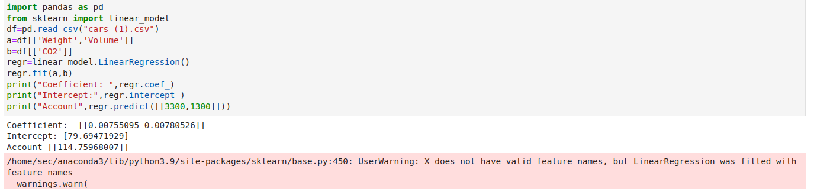

# Implementation of Multivariate Linear Regression
## Aim
To write a python program to implement multivariate linear regression and predict the output.
## Equipment’s required:
1.	Hardware – PCs
2.	Anaconda – Python 3.7 Installation / Moodle-Code Runner
## Algorithm:

## Step1:
Import pandas.

## Step2:
Impor linear model from sklearn.

## Step3:
Read the files cars.csv.

## Step4:
Assign he values for x and y as requried.

## Step5:
Create the LinearRegression model and predic he output.


```
Developed by: LISIANA T
Register No: 212222240053
import pandas as pd
from sklearn import linear_model
df=pd.read_csv("cars (1).csv")
a=df[['Weight','Volume']]
b=df[['CO2']]
regr=linear_model.LinearRegression()
regr.fit(a,b)
print("Coefficient: ",regr.coef_)
print("Intercept:",regr.intercept_)
print("Account",regr.predict([[3300,1300]]))


```
## Output:




<br>

## Result
Thus the multivariate linear regression is implemented and predicted the output using python program.